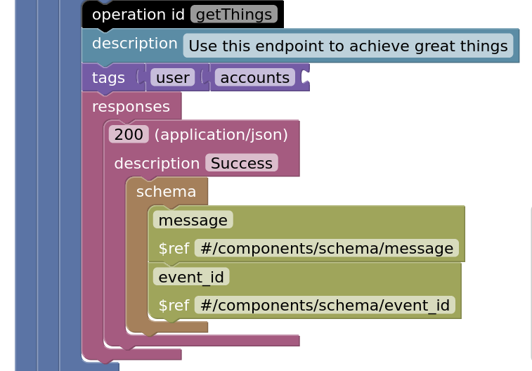

# Blockly representation of OpenAPI

This doesn't compile to OpenAPI (pull requests welcome), but I use these blocks as a teaching aid. You're welcome to use them too.



## Get started

Run `npm install`.

Then serve `index.html` locally. It's useful to have it reload, so I use this:

```
npx browser-sync start --server --files index.html
```

### Example blocks

Try `example.json`.

### Technical notes

The "save" functionality uses local storage so you can engineer the blocks without losing what you built on reload.

## Used by

Send a pull request if you use this project? Let's share!

- Lorna ( [me](https://github.com/lornajane/) ) in my talk [OpenAPI for Documentarians](https://noti.st/lornajane/4Ojem2/openapi-for-documentarians)
